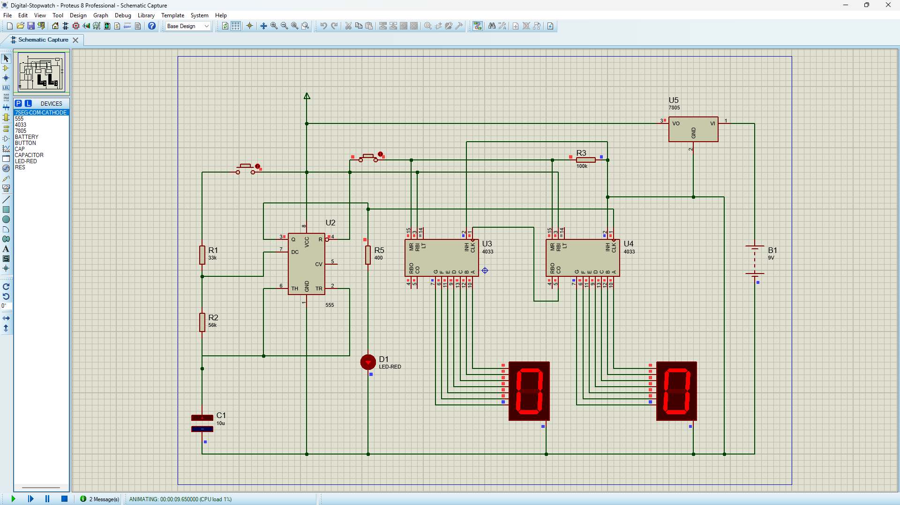

# Digital Stopwatch & Timer

Team project — Logic Design course, Helwan National University (2025)

## Components Used
- CD4033 BCD counters
- NE555 timer IC
- 7805 voltage regulator
- 7-segment displays

## Circuit Simulation
Built and simulated in Proteus 8.

